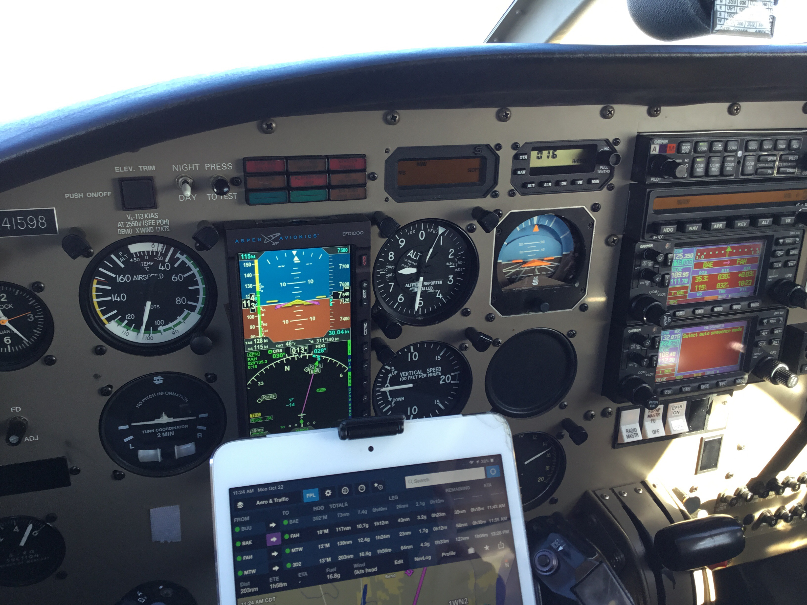
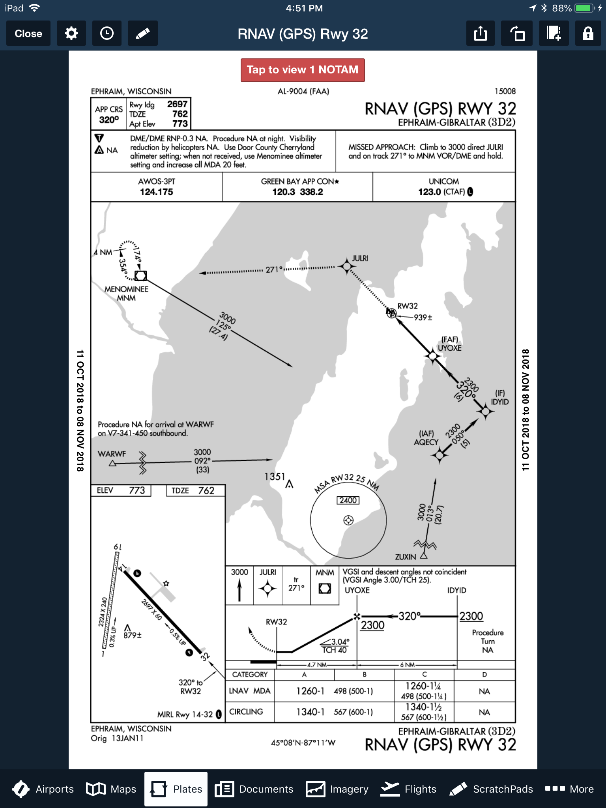
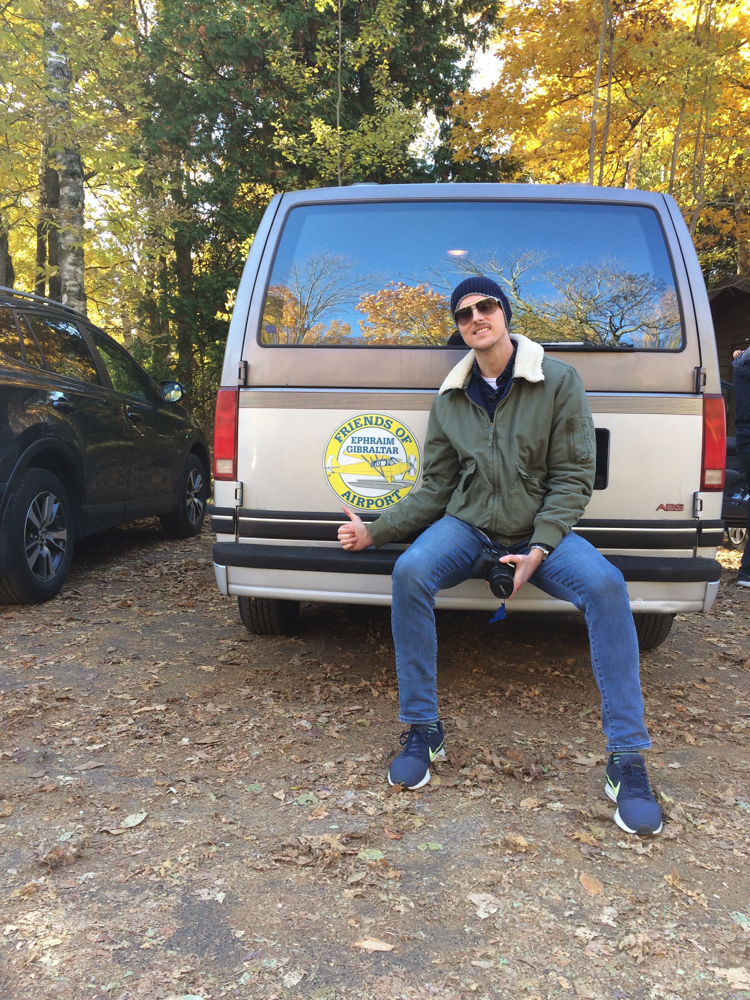

In my younger years, I was always skeptical of airport codes containing a mixture of letters and numbers. I thought these are locations not worth landing in, as the runways were probably grass and the services provided would be minimal and useless. Even more so in the Fall. This flight changed my perceptions indefinitely.

With winter fast approaching and I in need of more XC PIC and simulated IFR time, I thought it would be a great idea to invite my friend Tomek from the flying club to plan a day trip with me up north, to Door County, Wisconsin. I’ve never been to this part of Wisconsin, but the people I have spoken with all had positive things to say. Given that the distance is just over 200NM each way, I thought it would be a great way to log some quality XC time and perhaps dive a little more into the intricacies concerning the usage of the GNS430. Some goals I had set for myself included:

    Become more used to flying longer distances away from home base.
    Learning more about the GPS and navigation capabilities of the GNS430 in conjunction with the Aspen EFD1000.
    Developing proper IFR instrument scans and leveraging the AP so that I can better manage the flight.

Some things that did not quite work out as I had hoped regarding the flight included:

    Knowing my fuel burn figures and estimated times to complete each of my planned legs. This was lost in the GPS planning.
    Understanding altitude constraints as they are applicable to setting up for an IAP at any given destination airport. Also, relevant checklists before commencing an IAP into an unfamiliar airport (more on this later).

The day began uneventfully with a wake-up at 7AM to make it for the pre-flight of our Piper Archer by 0900. With weather forecast as VFR for the duration of the day, I knew we would not an issue to make a go/no-go decision. Before hand, Tomek and I agreed that I would fly the leg, mostly under simulated IMC to 3D2. Tomek would captain the return leg. The planned routing for my sector is portrayed below:

The green dots all around indicate favorable VFR weather conditions. Most of the flight was planned over terrain, in the rural parts of Illinois and Wisconsin. I specifically selected VOR and waypoints as much as possible to maximize my ability to create a legitimate flight plan in the 430. Wheels up time was approximately 1030, with an initial cruising altitude of 3,000 feet climbing 7,500 after we clear the Bravo shelf. I picked up flight following from Milwaukee Approach when we were 15 to the west, and utilized that feature until approximately SUE, where we disconnected to make preparations for the IAP RNAV 32 into 3D2. Flight following was a great asset to the flight, even though we barely received any advisories because of the low level of traffic in the area. We additionally were ADS-B equipped so traffic advisories appeared on our IPads.

Much of the flight was uneventful, save for the fuel pressure indication that was almost at 0 during the climb phase to 7,500. This was the highest altitude I have ever personally flown at, so I was initially not so suspicious about the indication as Tomek was. Leveling the aircraft off, the gauge picked up, but turning the electrical auxiliary fuel pump ON made the needle jump even more. I figured the supplemental fuel pump can help us in case the engine driven fuel pump was not producing enough power for the flight. There was no hesitancy from the engine whatsoever, and that weighed into my calculations as well. Throughout a majority of the flight, there was not much to see visually, so it was refreshing for me to be able to concentrate fully on the instruments to log the necessary simulated IMC for my instrument rating. Tomek did a good job scanning for traffic, but on an October Monday morning, there did not seem to be much in the air within these regions of rural Wisconsin. He provided me w its a lot of useful insights concerning the programming and execution of various bits concerning the 430.

The winds at the destination were variable, anywhere from 190 to 260 at around 8 knots with infrequent gusts to about 13 knots. This probably did not cause as much concern for me as it should have – the landing was a bit rough to say the least. I elected for the paved runway which was short, narrow, and sporting a healthy cross-wind as well. If the crosswind component was exceeding 12 knots or so, I think I would have elected for the grass strip at the airport. Around SUE, I began making the mental calculations to ensure we cleared AQECY at 2,500. A picture of the procedure I was setting up for is referenced below:

This is where the flight became the most beneficial for me. Tomek, is very proficient at instrument flight, he was able to provide me with all his knowledge thus far regarding the proper execution of such an RNAV approach. We first conducted an approach briefing where we reviewed the critical pieces concerning this chart, such things as:

  - The procedure itself, coded and verified against the waypoints selected for the IAP in the 430.
  - Applicable minimum descent altitudes
  - Applicable step down fixes and mandatory altitude requirements
  - Maintaining the applicable speed during each phase of the approach (IAF, IF and FAF)
  - Running through an assortment of checklists to ensure everything is prepared: PIKE, GUMPS, 5 T’s
  - Discussing the holding procedure if we would have gone missed

For the most part, the approach was conducted well with particular emphasis I need to place on further training for the following aspects:

  - Speed control
  - Land/Go Around decision making
  - Taxi after landing information

It was a difficult landing for me, particularly because I am used to urban runway environments offering 8,000 feet and 150 feet width. For this runway, I had approximately 2600 feet and 60 feet with a moderate cross wind! The winds were quite gusty on approach, which resulted in a bounce on landing. I should have realized the speed situation a little earlier on and conducted a go around. Nevertheless, we did get down, taxied to the general apron area and shut down. We deplaned in an effort to find some staff but the FBO was closed until Friday. Luckily, there was plenty of posted signage with phone numbers to contact airport staff, with the result of us being given the opportunity to use the airport van to do some sight seeing in the area for several hours! Additionally, there were bikes available to use as well, and we treated this transportation option as a fail-safe in case we could not gain access to the vehicle.

Exploring the city of Ephraim and Fish Creek was exciting – this is the perfect time of the year to plan such travels. The Fall foliage combined with the off season really makes the local scene relaxed, mellow, and feeling a bit abandoned. It was great for a day trip. Peninsula State Park was a treasure to behold, with beautiful sights all around. Some of these pictures will be uploaded and shared on this blog.

