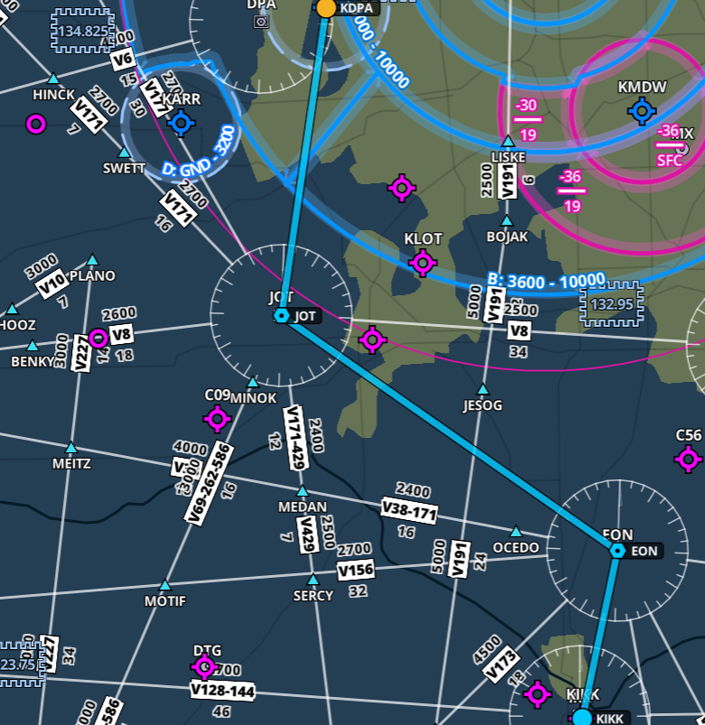

I’ve officially kicked off my training for the FAA instrument rating in the Fall, and have begun flying with an instructor to build the necessary time and experience. Some of this experience includes 50 hours of cross-country time, where I need to fly and land at an airport 50 nautical miles from my origin. The other requirement is to have 40 hours logged in either simulated or actual instrument meteorological conditions. I also need some time flying around with an instructor to build the requisite skills when flying under the hood.

At the FAA, the IR is one of the more difficult licenses to obtain, primarily because it introduces the pilot to an entirely new type of flying. In instrument flying, the pilot does not fly by visual reference but instead, by their instrumentation. This changes the flying game entirely, as pilots must now balance a very busy workload managing things inside the flight deck with flying the airplane. Given all the new skills I’ll need to develop, I often enlist the help of fellow club members to come flying with me. This gives me the opportunity to have my flying critiqued, and correct areas of weakness before they build into bad habits. At one of our monthly flying meetings, I met a fellow member, Frank, who just completed his IR and would be willing to come along to critique my flying.

On a last-minute whim due to some favorable warm weather and a short work week, we decided to plan a quick cross-country flight to Greater Kankakee airport (KIKK) from KDPA, my home base. The route I planned was:

**KDPA JOT EON KIKK**

Total flying time was approximately ~ 45 minutes each way. The plan was to touch down at the airport, taxi back and take off again back for KDPA. Before takeoff, I tuned as many of the parameters concerning the flight as I could, including radio frequencies, the expected approach at KIKK (ILS 04) and the various navigation radio facilities along the route (JOT, EON). Frank and I agreed that I’ll be the PF (pilot flying) and he will be my safety pilot in the form of PIC PNF. As there are two crew-members required for this type of flight (one scanning the outside for traffic, the other flying), we are both legally able to log PIC time for the duration of the flight that I am operating under the hood. We took off from RWY 20R at 21:02 CDT.

The Piper Archer III is an absolute breeze to fly. I like the low-wing configuration better than a Cessna, and the tank switching every 00:45 minutes makes it a less forgiving airplane, than, a Cessna, where gravity keeps the fuel supply to the engine going. I’ve been focusing all my flying in this single airplane in order to become as comfortable with it as possible, in addition to the avionics which include 1 GPS430W, 1 GPS430, STEC 55X Auto Pilot, ADS-B IN/OUT, and an ASPEN EFD1000. It’s the relationship between the ASPEN EFD and the 430W that I need to pay the most attention to, as these two tools are simply indispensable for a modern IFR flight.

During the en-route phase I began setting up for the approach. In instrument flying, the pinnacle of the entire flight rests on the pilot properly flying an approach procedure into an airport that is capable of handling these types of arrivals. Before commencing the approach, the pilot first needs to brief it, based on the chart for that airport and runway. The pilot must always tune, and identify all ground based navigation systems and follow the descent and landing checklists. Here we have the KIKK ILS 04 approach that I was going to fly into the airport: 

Briefing the approach needs to begin from the top of the strip, and working your way down. The first things to note are the Airport, Runway, and localizer approach frequency, 108.7. Next, the final approach course, 038 degrees. Then, our landing distance gives us a good idea about how much length we have for our touch-down and roll-out. Next, we review the pertinent notes. Circling to the opposed 16/34 RWY at night is forbidden, and increases to the decision altitude must be made if certain criteria are met, such as in-operational runway lights or a lack of altimeter setting.

As I was planning to begin the approach at the IAF of LUKOW, which also serves as the LOM/IAF, I would be required to do a procedure turn. The orange loop toward the bottom of the picture shows me reversing my course to intercept the localizer for RWY 04. As this is a precision approach, there is no need to brief the various step down fixes associated with the approach, such as the altitude requirement at LUKOW. We must however, throughout the approach and before flying to the FAF, maintain at least an altitude of 2,300 feet until the glide slope intercept altitude, which is 1,900 for this approach. We brief our minimum altitude for the S-ILS-4 in the bottom table for the type of aircraft we are, Category A, and our decision altitude is 824 feet MSL with a requirement of 1/2 SM forward visibility.

Finally, the briefing then goes into the missed approach procedure. What happens if we get down to 824 feet, and don’t see the runway? Legally, we must execute a missed approach. This means we’ll need to fly up and away from the airport, and enter a holding pattern to then decide what we’d like to do next. This is document in the top right hand side of the briefing chart, all caps MISSED APPROACH. In this instance, we’d climb back up to 2,300 feet, then turn right and fly direct to the IKK VOR and enter a holding pattern.

I flew the approach exactly in this manner, flying DCT to LUKOW, and then tracking 218 degrees outbound from it while using the GPS 430W to drive the navigation. Then, after about 4NM from LUKOW I began my turn inbound, and meanwhile, switched my CDI from GPS to VLOC, in order to bind the GPS430W to the ground based navigation. At 2NM from the FAF, I slowed to 90 KIAS, and intercepted the glide slope. At this point, it was quite a battle to maintain the glide slope and localizer so most of my energy was going towards maintaining a stable approach. After going visual, I deployed flaps and landed, taxied back and took off towards the southwest on runway 22.

The flight back was similar, though this time we were flying back north to KDPA in order to intercept the FAF for the 20R approach. We didn’t want to fly all the way up north to the IAF, as that would add quite a lot of time onto the flight just to track the course southbound again. This approach was again, difficult, given the complexity of all the pieces involved. But with practice, I will need to habitualize all the actions that need to happen so that I can spend time focusing on flying the airplane, and not spending my time trying to remember what I need to do at a certain stage of the flight. Practice makes perfect. My next flight will be an IFR flight from KDPA to KRFD, and shooting the back-course LOC RWY 19 approach.