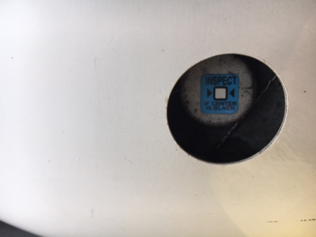
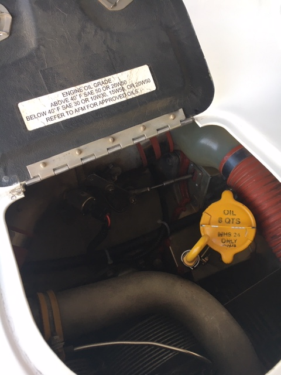
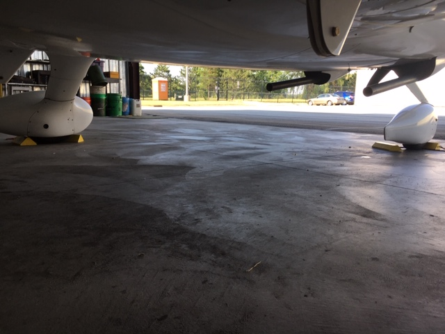
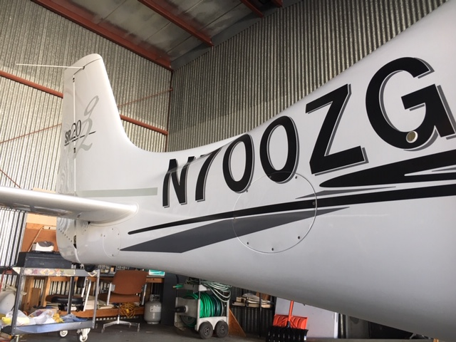
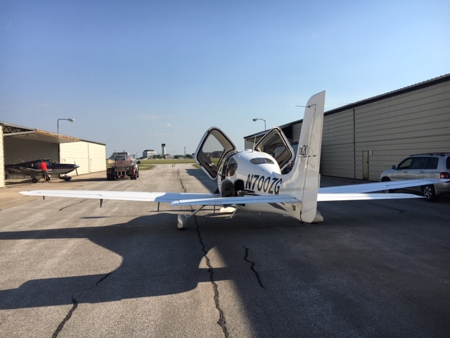
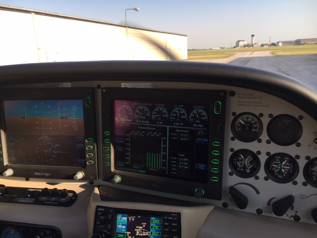
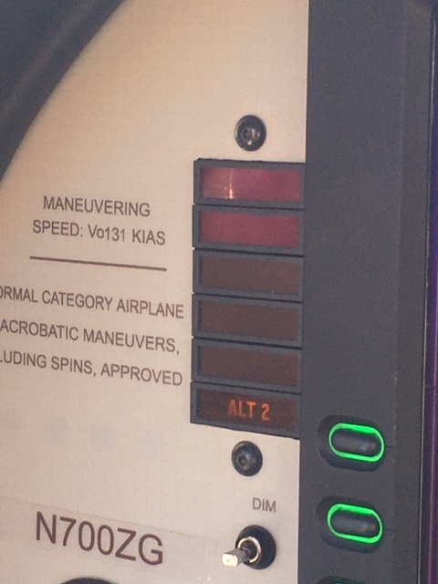

It’s been quiet on this blog – mostly because Corona-virus has kept a majority of pilots grounded for the last couple of months while the board sorts out the details of getting us back in the air. As I understand it, we are designated as a non-essential business in the state of Illinois, which brings along a variety of limitations, including no flying. As the state begins to open back up, the limitations placed upon our club continue to be relaxed. At the time of this writing, we are allowed to fly while wearing face masks, ensure we keep social distancing with one another, and follow close protocol concerning the cleaning and decontaminating of airplanes before and after any flight.

Given that I haven’t been up in a while, I was eager to get flying again and wrap up my “type” training for the Cirrus SR-20 our flying club recently acquired. I had about three flights in the airplane, and needed one more to get signed off to fly it solo, but that never happened. My flight instructor may not believe they will return for this flying season and so I’ll have to find another one, in order to wrap up my Cirrus training and instrument rating.

Yesterday, 6/18, my friend Tomasz called me up at the last minute and asked if I was interested in going up with him. The plan was going to be a few takeoffs and landings at KDKB, along with two approaches and a holding pattern using the SR-55 A/P. I happily obliged as I have not been up for a long time and felt my skills beginning to erode and get rusty, plus it was a good excuse to just get out of the house and get moving again. We agreed to meet at the hangs at 17:00. A very thorough pre-flight followed, checking such things as:

Each main landing gear wheel has a brake wear sticker affixed to it. The brake wear sticker, if black, specifies that the brakes were overheated during landing/taxi and should be inspected. Light grey means your good to go. 

Oil is another area of common inspection. The dipstick was indicating 6 quarts, so we decided to add a quart of oil to bring the total up to 7 quarts, which sits right in the middle between the minimum, 6 quarts, and the maximum, 8 quarts.

Of course we checked a plethora of other things on the airplane as well, these just happen to be two elements I happened to snap a picture of during pre-flight. Some other photos:

We pulled the airplane out and into the alley:

We next focused on configuring the avionics, headsets, and routing. We checked the applicable weather, NOTAMs, TFRs, and any restrictions that would pose an issue to the flight we were aiming to complete for the day. The plan was to fly to KDKB to execute the RNAV GPS 27 instrument procedure, discontinuing the approach at DA and flying straight to the holding pattern. Afterward, several takeoffs and landings were in order to get a feel for the airplane and it’s landing and takeoff capabilities in different types of configurations.

You can see KDKB loaded in GPS1 on the bottom of the screen, the engine is stabilized and running, and we have just obtained Information Charlie, specifying weather with ceilings > 5,000 feet and visibility > 5 SM. Winds were 100/09. We taxied for RWY10 with E F, and took off shortly thereafter.

After takeoff, we continuously had the ALT2 indication steady on. 

ALT2 indication steady ON.

Now, we understand that ALT2 is triggered to come online at RPM’s of around 1,700 or greater. However, we were at full takeoff power for several minutes and the light continued to be on. We therefore references in the abnormal checklist in the MFD to troubleshoot the issue. The steps were quite simple, ALT2 master switch OFF, ALT2 circuit breaker reset, ALT2 master switch ON. If the light continued, we should unload any unnecessary electrical features and land immediately. This is precisely what we did. We wrapped around and landed back on Runway 10 with no incident.

Sometimes, plans just don’t work out. In aviation, it’s critical to not push forward when you feel uncomfortable or ought not to. In this case, the ALT2 would not have probably played a significant role in any sort of catastrophic incident as ALT1 seemed to be running reliabily still, but such chances should not be taken.