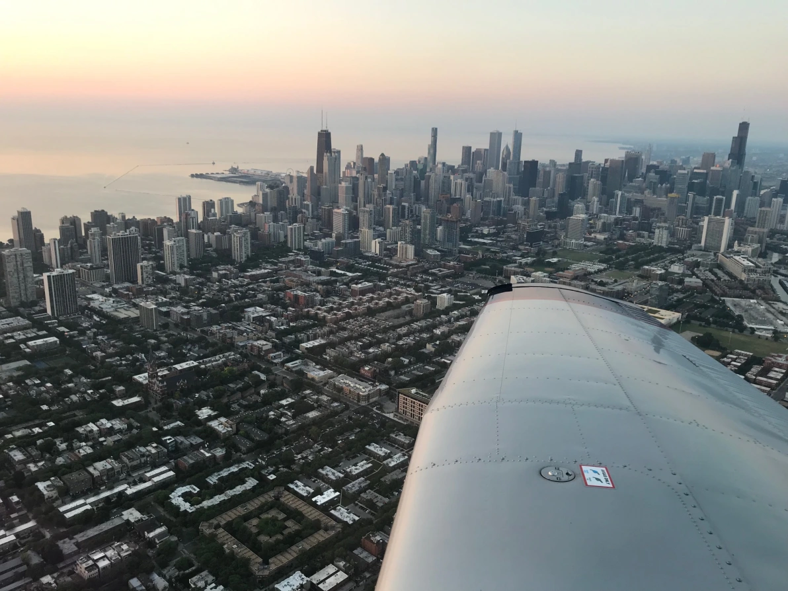
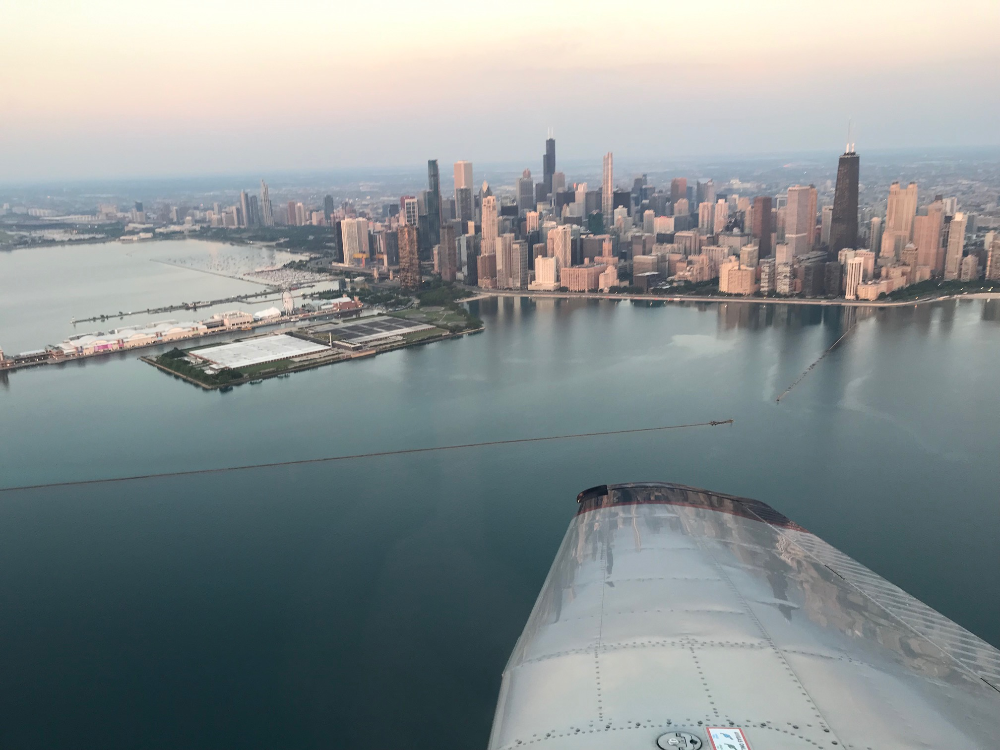
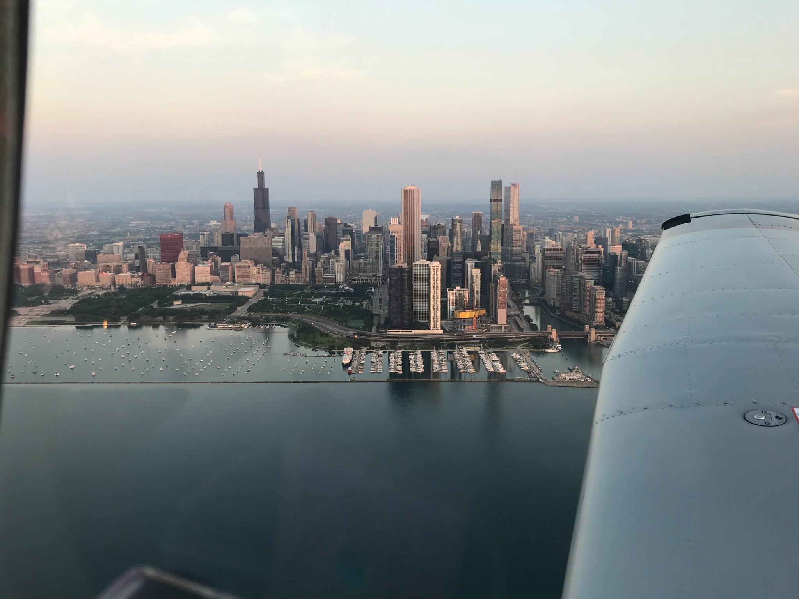
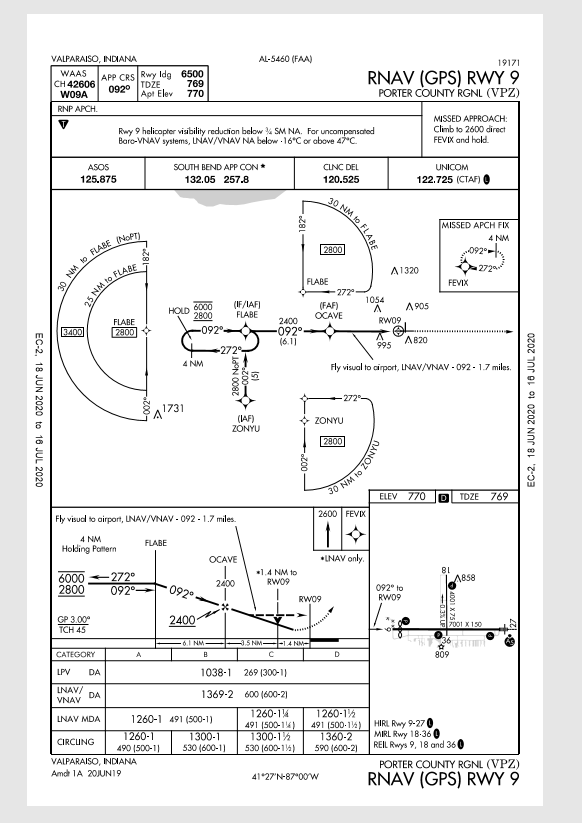
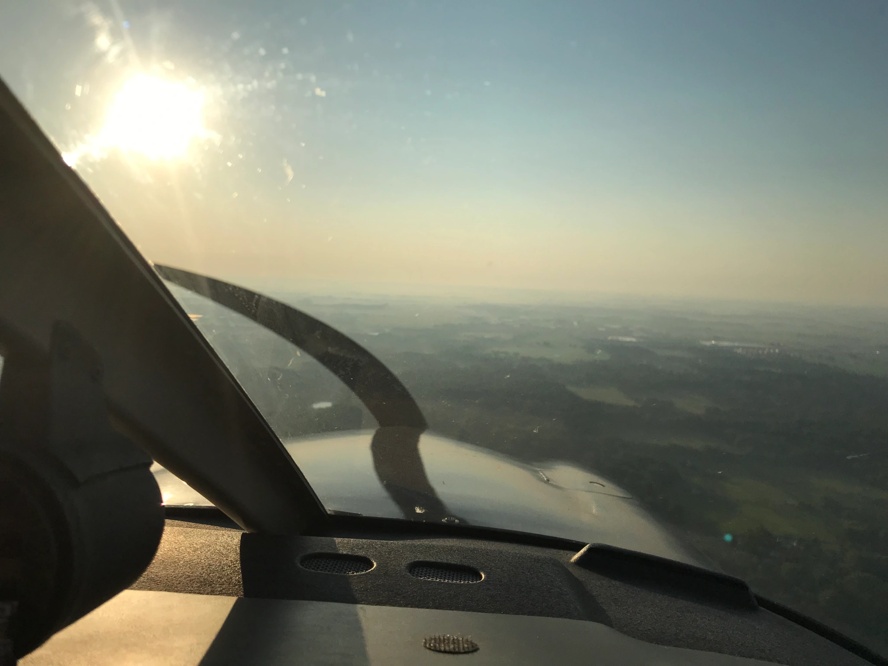

I discontinued my instrument rating training in November, though I didn’t know it at the time. The weather was turning winterly and Zulu AIRMETs were becoming the norm, keeping me grounded on more occasions than I care to count. As any general aviation pilot knows, dealing with structural icing is extremely dangerous and difficult – you don’t want to find yourself in the air picking up ice with limited options for landing.

I therefore didn’t fly much over the winter, and focused on obtaining a Cirrus SR-20 checkout and continuing my instrument training thereafter. With one flight remaining on the checkout, I have yet to complete it as my instructor will likely not return to instructing this year due to working on the front lines of COVID. I am however, returning to the air with another instructor, Terry, to continue and (hopefully) wrap up my instrument training and move on to the commercial license. The final one will be a multi-engine rating from Skill Aviation (DA-42!), but that won’t be for another year or two.

I’ll be formally starting back up on the instrument rating on July 15, as the club is open for business and the virus spread seems to have halted, at least in Illinois. I’m halfway towards the license already, with 20 hours of simulated IMC in my logbook along with 29 instrument approaches logged.

For today’s mission, Tomasz and I decided to do a sunrise flight. As we are in the peak of summer, sunrise is at approximately 05:30. We therefore agreed to meet at the hangar at 04:30 where I was going to be PF for the first leg. The weather was going to be another beautiful day, with patches of mist and fog spread cross northwest Indiana, where I intended to fly an IAP into KVPZ, Valparaiso. The flight was quite the thrill, as there was nearly nobody in the air or on the airport at this time, and the sun was slowly starting to climb while temperatures were still relatively cool. We preflighted, requested full fuel and shot off Runway 10 at 05:19 local time.

Tomasz encouraged me to fly the Eisenhower transition which I never did before. My version of Foreflight did not have I290 depicted, so we visually stayed clear of the Class-B and Class-C airspace while peeling our eyes to find the highway. We flew at 1,800 feet MSL the entire duration, and contacted Midway Tower to let them know we were monitoring their frequency for traffic or any other important notifications. They did not assign us a squawk code on our eastward journey, but did when flying back westward toward DPA. Likely because of the traffic loads. After reaching the downtown area, we did a circular flight around the area and proceeded southeast DCT KVPZ, transitioning through KGYY airspace. Pictures:

Once exiting, we were relatively close to the destination and so I loaded the RNAV GPS RWY 09 approach into the 430W and set up my approach plate and began briefing the approach. A helpful mnemonic here is PICA:

P: Procedure

I: Inspect IAP waypoints

C: CDI selection GPS or VLOC

A: Autopilot roll modes during the approach

Tomasz advised I fly the procedure turn for training purposes and I agreed. Approach plate:

Key pieces during the briefing include Final Approach Course, landing runway length, missed approach procedure, frequencies, LPV DA, and minimum altitudes for the various sectors and quadrants.

I therefore flew direct FLABE, at 2,800 MSL with the STEC55X in NAV mode. Once reaching the waypoint I switched the roll mode to Heading mode and selected 272 as the outbound course. As this was a direct entry (coming from a magnetic heading of 130), we didn’t have to fly any special procedure with joining the procedure turn. Once I flew heading 272 for 4NM, I switched the 430W to OBS mode and dialed in 092 for the CRS, to fly inbound the holding fix, FLABE. This completed the procedure turn and I could then sequence DCT OCAVE to the FAF and call GUMPS for my pre-landing checklist. The GUMPS checklist stands for:

G: Fuel tank switching

U: Undercarriage

M: Mixture

P: Propeller

S: Seat belts and switches (lights, pitot heat, etc.)

The 430W was picking up the LPV signal so DA was established at 1038 with 1SM visibility. AWOS was reporting 4SM with haze, and sure enough, this photo was snapped 3 minutes before touchdown:

Towards the end I lost the glideslope a little bit as I was fixated on tracking the localizer. Nevertheless, we broke out of the fog and I was able to see the runway and visually land without incident. We arrived at the FBO and debarked for a debriefing on how to properly enter holding patterns and Tomasz took over for his leg of the flight. This included an RNAV approach at 05C and then heading back to base.